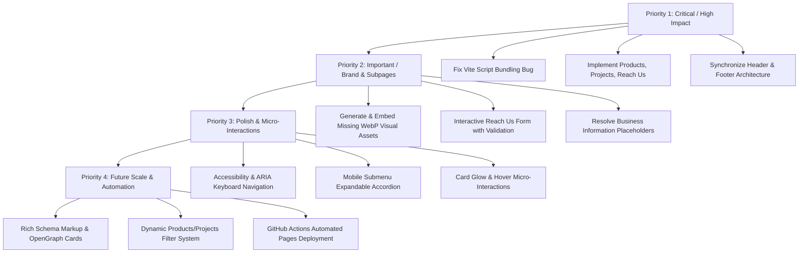

# Shiv Shiv Sparkline — Development Roadmap

**Document Version:** 1.0.0  
**Status:** Planning & Architectural Alignment  
**Target:** Phased Engineering Implementation  

---

## Roadmap Overview

This roadmap defines the structured, prioritized development plan for the Shiv Shiv Sparkline website. All recommendations preserve the existing vanilla HTML5, CSS3, ES6 JavaScript, and Vite multi-page architecture, keeping the mandatory homepage background video completely intact and upholding the corporate dark aesthetic.

---

## PRIORITY 1 — Critical / High Impact

### 1.1 Fix Vite Production Script Bundling (`type="module"`)
* **Current State:** `` (with modular imports of `navigation.js`, `scroll.js`, and `animation.js` from `main.js`), or specify `type="module"` on individual script tags.
* **Why It Matters:** Production deployment to GitHub Pages or any static CDN is currently broken without this fix.
* **Affected Files:**
  * `index.html`
  * `about.html`
  * `products.html`
  * `projects.html`
  * `contact.html`
  * `js/main.js`
* **Risk Level:** Very Low (standard modern web and Vite architecture).
* **Expected Impact:** 100% functional production builds and zero 404 script errors.

---

### 1.2 Implement Full Subpage Layouts for Products, Solutions & Projects, and Reach Us
* **Current State:** `products.html`, `projects.html`, and `contact.html` are bare skeletons containing only empty placeholder headers and commented future sections.
* **Proposed Change:**
  1. **`products.html`:** Build a rich corporate catalog showcasing Shiv Shiv Sparkline's 3 primary product categories:
     * *Electrical Trading Products:* Power Cables (LT/HT, Armoured, Flexible), Connectors & Terminations, Insulators (Pin, Disc, Post, Polymer), Conductors (ACSR, AAAC, Copper), Metering Solutions & VCBs.
     * *Solar Energy Components:* Solar Cables, Connectors (MC4), Inverters & Combiner Enclosures, Mounting Structural Hardware.
     * *EPC & Infrastructure Hardware:* Transformers, Panel Enclosures, Earthing & Lightning Protection.
     * *Interactive Feature:* Category filter tabs, technical spec tables, and "Request Specification Sheet" CTA triggers.
  2. **`projects.html`:** Build a dedicated showcase highlighting solutions and project supply capabilities:
     * *Sectoral Solutions:* Utility & Substation Supply, Industrial Plant Infrastructure, Commercial Rooftop Solar, EPC Contractor Material Coordination.
     * *Project Footprint & Case Studies:* Industrial distribution footprints across Rajasthan, turnkey supply timelines, logistical coordination highlights.
     * *CTA:* "Partner on Upcoming Tender / Project".
  3. **`contact.html`:** Build a high-converting corporate contact and RFQ (Request for Quote) hub:
     * *RFQ Form:* Inquiry type selector (Product Quote, EPC Supply, Solar Project, General Inquiry), project capacity, material requirements, file attachment note.
     * *Direct Reach Channels:* Rajasthan distribution regional coverage, direct phone, corporate email, operational hours.
     * *Interactive FAQ / Inquiry Guide.*
* **Why It Matters:** Without these subpages, 60% of the website navigation routes lead to empty pages, hurting credibility and lead generation.
* **Affected Files:**
  * `products.html`
  * `projects.html`
  * `contact.html`
  * `css/style.css` (or dedicated modular subpage styles)
* **Risk Level:** Low (additive changes matching existing design system).
* **Expected Impact:** Complete corporate credibility, enhanced SEO, and functional multi-channel lead acquisition.

---

### 1.3 Synchronize Global Header & Footer System Across All Pages
* **Current State:**
  * `index.html` and `about.html` use the complete 6-column dark footer with newsletter signup, whereas `products.html`, `projects.html`, and `contact.html` use an outdated 3-column footer with mismatched CSS classes.
  * In the About Us dropdown submenu strip, `products.html`, `projects.html`, and `contact.html` have a swapped link order for "Core Services" and "Vision & Mission".
  * `products.html`, `projects.html`, and `contact.html` lack the `.static-header` class on `<header>`.
* **Proposed Change:** Unify the header and footer HTML markup across all 5 pages so that every page uses the identical 6-column footer and uniform navigation structure.
* **Why It Matters:** Eliminates visual glitches, broken styles when navigating between pages, and maintains a seamless corporate identity.
* **Affected Files:**
  * `products.html`
  * `projects.html`
  * `contact.html`
* **Risk Level:** Very Low.
* **Expected Impact:** 100% design consistency across the entire domain.

---

## PRIORITY 2 — Important

### 2.1 Generate and Integrate Missing Image Assets (`assets/images/`)
* **Current State:** `about.html` references 12 `.webp` images across `assets/images/about/`, `assets/images/founder/`, `assets/images/services/`, `assets/images/certificates/`, and `assets/images/timeline/`. These files do not exist on disk, relying on CSS canvas fallbacks.
* **Proposed Change:** Create high-quality, professional corporate imagery in modern `.webp` format and organize them into clean directories:
  * `assets/images/about/` (Enterprise sourcing facility / logistics)
  * `assets/images/founder/` (Executive portrait / corporate leadership placeholder)
  * `assets/images/services/` (Electrical cables, solar installations, EPC project coordination, procurement channels)
  * `assets/images/certificates/` (GST, MSME, Company Profile document cards)
  * `assets/images/timeline/` (Company milestone visuals)
* **Why It Matters:** High-end visual assets dramatically elevate trust, brand authority, and visual engagement.
* **Affected Files:**
  * `assets/images/*` (New directory and files)
  * `about.html`
* **Risk Level:** None (pure asset addition).
* **Expected Impact:** Visually rich presentation without relying on empty canvas boxes.

---

### 2.2 Form Validation & Interactive Feedback for Contact & Newsletter
* **Current State:** Contact and newsletter forms have `onsubmit="event.preventDefault();"` with no user feedback, state validation, or submission confirmation.
* **Proposed Change:** Add client-side validation (email syntax, required field indicators) with toast notification / inline success states to give immediate professional feedback upon submission.
* **Why It Matters:** Reassures prospective clients that their inquiry or quotation request was received.
* **Affected Files:**
  * `js/main.js`
  * `contact.html`
  * `index.html`
  * `about.html`
* **Risk Level:** Low.
* **Expected Impact:** Greatly improved conversion rate and user experience.

---

### 2.3 Clarify & Replace Business Data Placeholders
* **Current State:** Placeholders present in `about.html` and footers: `[Founder Name - Placeholder]`, `[Signature Placeholder]`, `[Email Placeholder]`, `[Phone Placeholder]`.
* **Proposed Change:** Prepare a clean business configuration placeholder block and solicit verified company information from the business stakeholder (official registered office address, director name, verified GSTIN/MSME identifiers, official email addresses).
* **Why It Matters:** Eliminates unpolished bracketed text in production while ensuring 100% compliance with authentic company data.
* **Affected Files:**
  * `about.html`
  * `index.html`
  * `contact.html`
* **Risk Level:** None.
* **Expected Impact:** Fully authenticated corporate footprint.

---

## PRIORITY 3 — Polish

### 3.1 Mobile Drawer Navigation Enhancements (Submenu Accordions)
* **Current State:** Mobile drawer displays a flat list of 5 top-level links without submenu support for the deep sections in `about.html`.
* **Proposed Change:** Add an expandable accordion in the mobile drawer for "About Us" so mobile visitors can access sub-anchors (Company Profile, Services, Certifications, Journey) easily.
* **Why It Matters:** Enhances mobile information architecture and user navigation speed.
* **Affected Files:**
  * `navigation.css`
  * `js/navigation.js`
  * All HTML files (mobile drawer markup)
* **Risk Level:** Low.
* **Expected Impact:** Superior mobile UX.

---

### 3.2 Accessibility & Keyboard Focus States (A11y Audit)
* **Current State:** Some interactive items (e.g. ``) rely on `hover` states; keyboard focus indicator styles and ARIA attributes (`aria-expanded`, `aria-haspopup`) can be sharpened.
* **Proposed Change:** Add explicit focus rings (`:focus-visible`), ARIA attributes for dropdowns and accordions, and keyboard toggle support (Enter / Space to expand dropdowns).
* **Why It Matters:** Ensures WCAG 2.1 AA accessibility compliance and keyboard navigability.
* **Affected Files:**
  * `css/navigation.css`
  * `css/components.css`
  * `js/navigation.js`
* **Risk Level:** Low.
* **Expected Impact:** Enhanced accessibility and SEO quality score.

---

## PRIORITY 4 — Future Scalability

### 4.1 Automated GitHub Actions Deployment Workflow
* **Current State:** GitHub Pages deployment is manually configured or tracking root `main`.
* **Proposed Change:** Add `.github/workflows/deploy.yml` to automatically build with Vite and deploy the `dist/` directory to GitHub Pages on every push to `main`.
* **Why It Matters:** Automates continuous integration, ensures optimized asset builds, and eliminates manual deployment errors.
* **Affected Files:**
  * `.github/workflows/deploy.yml` (New file)
* **Risk Level:** Low.
* **Expected Impact:** Frictionless continuous deployment.

---

### 4.2 SEO Schema Markup & OpenGraph Social Cards
* **Current State:** Standard `<meta name="description">` tags exist; OpenGraph social preview tags and JSON-LD structured schema (`Organization`, `Product`, `LocalBusiness`) are not yet included.
* **Proposed Change:** Add JSON-LD structured data and OpenGraph/Twitter card meta tags to all pages.
* **Why It Matters:** Enhances search engine visibility and ensures rich previews when sharing links on LinkedIn, WhatsApp, and social channels.
* **Affected Files:**
  * All HTML files
* **Risk Level:** None.
* **Expected Impact:** Maximum organic search presence and professional link previews.

---

## Summary Matrix of Affected Files

| File | Priority 1 | Priority 2 | Priority 3 | Priority 4 |
| :--- | :---: | :---: | :---: | :---: |
| `index.html` | Script bundling | Form feedback | A11y audit | Meta & OG tags |
| `about.html` | Script bundling | Image assets & Data | A11y audit | Meta & OG tags |
| `products.html` | Full Page Build & Header/Footer Sync | Product specs | Filter tabs | Product Schema |
| `projects.html` | Full Page Build & Header/Footer Sync | Case studies | Project cards | Schema tags |
| `contact.html` | Full Page Build & Header/Footer Sync | RFQ form validation | Field tooltips | LocalBusiness Schema |
| `css/style.css` | Subpage styling | Card animations | Focus states | — |
| `js/main.js` | Module orchestration | Form handlers | Modal/Drawer triggers | — |
| `.github/workflows/deploy.yml` | — | — | — | CI/CD pipeline |
